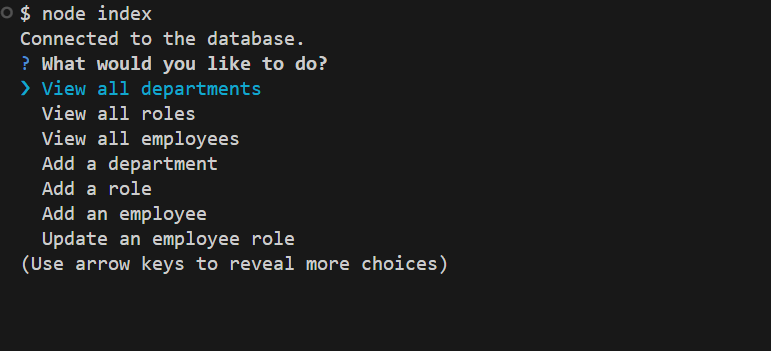
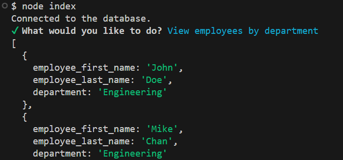
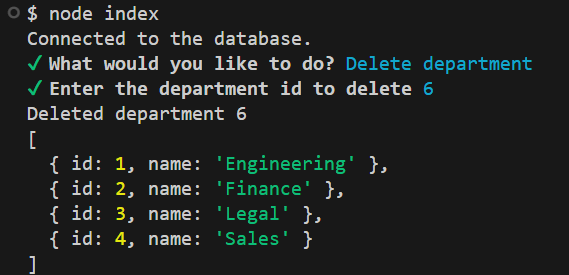

# Content Management Systems Interface

## Description

This application will help a company to view and mangage their departments, roles, and employees using an interactive CLI interface.  


## Table of Contents

- [Installation](#installation)
- [Usage](#usage)
- [Credits](#credits)
- [License](#license)
- [Features](#features)
- [Contributions](#how-to-contribute)

## Installation

To use this application, you must install the following;

1) VS Code
2) Node.js
3) PostgreSQL
4) Node packages
    - inquirer
    - pg
    - dotenv

## Usage

Follow these steps to use the app:

1) Open the app using VS Code.
2) Ensure that you install the dependencies named in the installation instructions above.
3) Open a new terminal in the directory containing index.js.
4) Enter the command "node index".
5) Follow the prompts (see - [Features](#features) below) to interact with the app.

## Credits

The following guide was used to produce this README.md document: [https://coding-boot-camp.github.io/full-stack/github/professional-readme-guide].

The npm Inquirer.js README.md document was used for guidance on this project: [https://www.npmjs.com/package/inquirer].

## License

[](https://opensource.org/licenses/MIT)

## Features

You can use the app to do the following;

```md

```

- View all departments

```md

```

- View all roles
- View all employees
- Add a department
- Add a role
- Add an employee
- Update an employee role
- Update employee manager
- View employees by manager
- View employees by department

```md

```

- Delete department

```md

```

- Delete role
- Delete employee
- View combined salary of employees by department


## How to Contribute

- Direct Request on GitHub [https://github.com/Theon87/content-management-systems-interface].

[](code_of_conduct.md)
